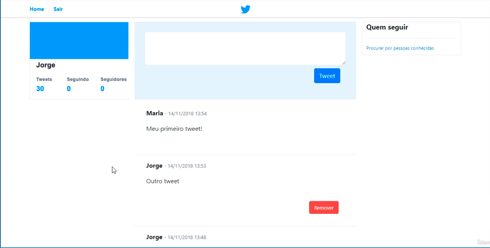
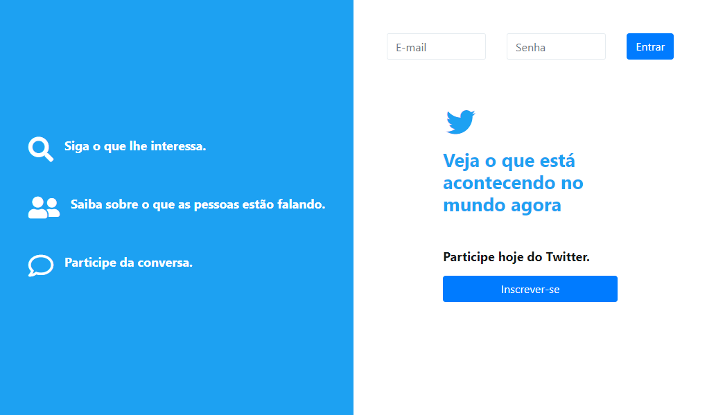
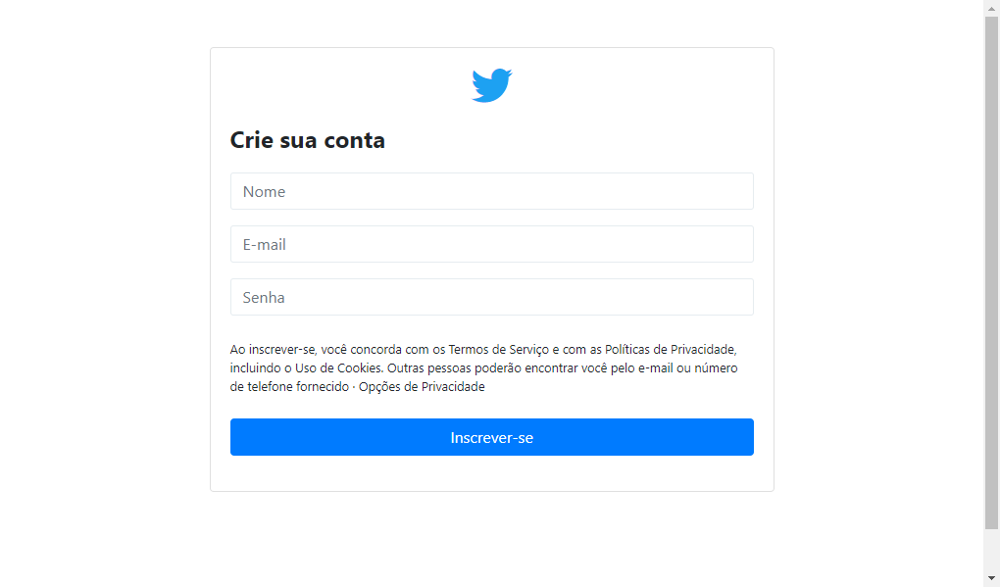

# TwitterClone
Este é um clone do Twitter com ênfase no desenvolvimento do backend, utilizando HTML, CSS, Bootstrap, JavaScript, PHP, MySQL e um mini-framework MVC.

## Visão Geral

O TwitterClone é um projeto que replica a funcionalidade principal do Twitter, concentrando-se no desenvolvimento do backend para gerenciar postagens, usuários e interações.

## Screenshots

Aqui estão algumas screenshots da aplicação:

## Tecnologias Utilizadas

- **HTML5 e CSS3:** Estrutura e estilo para uma experiência de usuário atraente.
- **Bootstrap:** Framework para facilitar o desenvolvimento responsivo e melhorar o design.
- **JavaScript:** Adiciona dinamismo e interatividade à interface do usuário.
- **PHP:** Linguagem de servidor para o desenvolvimento do lado do servidor.
- **MySQL:** Banco de dados para armazenar dados de usuários, postagens, etc.
- **Mini-Framework MVC:** Organização modular do código para uma arquitetura mais clara e escalável.

## Estrutura do Projeto

- `App/`: Contém a lógica de aplicação do mini-framework MVC.
- `public/`: Diretório público acessível para o servidor web, contendo arquivos estáticos.
- `vendor/`: Dependências do projeto gerenciadas pelo Composer.
- `config/`: Configurações relacionadas ao banco de dados, app, etc.

## Configuração e Uso

1. Clone o repositório: `git clone https://github.com/1bertojunior/TwitterClone.git`.
2. Configure o servidor web para apontar para o diretório `public/`.
3. Acesse a aplicação pelo navegador.

## Como Contribuir

1. Faça um fork do repositório.
2. Clone o fork para sua máquina local.
3. Faça suas modificações e adições.
4. Envie um pull request para análise.

Agradecemos por contribuir para o desenvolvimento do TwitterClone! Juntos, estamos criando uma versão incrível desta plataforma.

Divirta-se explorando o TwitterClone!